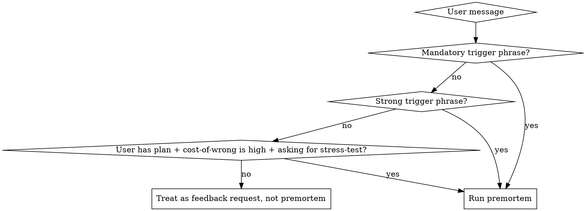

# Premortem

A premortem is the opposite of a postmortem. Instead of figuring out what went wrong after something fails, you imagine it already failed and figure out why before you start.

The method comes from psychologist Gary Klein. Daniel Kahneman called it his single most valuable decision-making technique. Researchers at Wharton called the underlying mechanism "prospective hindsight" and showed it significantly increases the ability to identify causes of future outcomes.

**Why this matters for AI-assisted decisions:** Claude defaults to agreeable, hedged responses. If you ask "is this a good plan?" Claude will find reasons to say yes. The premortem breaks this pattern by forcing the frame into "this is dead, explain how it died." Without that explicit frame, Claude defaults to forward-looking risk analysis, which is weaker — categories of risk instead of the specific story of how the thing actually fell apart.

## Core principle

**The frame is the mechanism.** "What could go wrong?" produces hedged risk lists. "It already failed — explain why" produces specific, honest, story-shaped failure modes. If you skip the frame, you're not running a premortem. You're doing a risk review and calling it a premortem.

## When to trigger this skill



**Good targets:** product/feature launches, pricing changes, hires, strategy or positioning pivots, partnerships, anything where the cost of being wrong is high and the decision is still reversible.

**Bad targets (don't run):**
- Requests for general feedback ("thoughts on this?", "what do you think?")
- Requests for editing or polish on a draft
- Vague ideas with no concrete plan yet (help them plan first)
- Decisions that are already made and irreversible
- Factual questions with one right answer

If the user is asking for *evaluation* but didn't ask for failure analysis, give them feedback. Don't unilaterally upgrade a "thoughts?" into a full premortem — it's heavy-handed and burns trust.

## The full procedure

There are six steps. Skipping any of them means you're not running a real premortem.

### Step 1 — Gather minimum context

A premortem on insufficient context produces generic failures. You need three things before proceeding:

1. **What is it?** — The plan, in one sentence you could say back to the user.
2. **Who is it for / who does it affect?** — Audience, customer, team, stakeholders.
3. **What does success look like?** — Failure is the inversion of success. If you don't know what success means, you can't define failure.

**Order of operations:**

1. **Scan the current conversation first.** The user may have already discussed the plan. Don't re-ask what they already told you.
2. **Scan the workspace** with `Glob` / quick `Read` calls (max 30 seconds). Look for: `CLAUDE.md`, `memory/` folders, `docs/`, files the user explicitly referenced, brief or plan documents. Pull whatever grounds the failure scenarios in reality.
3. **Fill remaining gaps conversationally.** Ask one focused question at a time. Don't batch 3+5 questions on the user — it feels like a form. Evaluate after each answer whether you have enough to proceed.

Examples of focused gap questions:
- "What specifically are you about to launch/build/decide?" (if you don't know what it is)
- "Who is this for?" (if you have the plan but not the audience)
- "What does a win look like?" (if you have the plan and audience but not success criteria)

If you can infer an answer from context, infer it. Don't ask just to ask.

### Step 2 — Set the frame explicitly

Before doing any analysis, state the premortem frame in plain language to the user. Something like:

> "OK, I have enough. Running the premortem. Premise: it's 6 months from now, [the plan] has failed. We're looking back at what killed it."

This is not optional decoration. It is the psychological mechanism that makes premortem work. Without the explicit "it has failed" frame, you will drift into forward-looking risk assessment ("here are some risks to consider") which is a different and weaker exercise.

### Step 3 — Generate failure reasons (raw premortem)

Generate a comprehensive list of genuine failure reasons, each in 1–2 sentences. The number is whatever is real for this plan — some plans have 4, others have 9. Don't pad to a target. Don't stop early if more exist.

Each failure reason must be:
- **Specific to this plan** — not generic startup advice
- **Grounded in the actual details** the user gave you
- **A genuine threat** — not a minor inconvenience or a black-swan edge case

Don't synthesize yet. Don't propose fixes yet. Just produce the list.

### Step 4 — Spawn deep-dive sub-agents in parallel (one per failure reason)

**This step is non-negotiable. You MUST use the Agent tool. You MUST issue all sub-agent calls in a single message so they run in parallel.** Sequential spawning wastes time and lets early responses contaminate later ones, which defeats the point of independent investigation.

Use this prompt template for each agent (substitute the specific failure reason for that agent):

```
You are an investigator in a premortem analysis. You've been assigned ONE specific failure reason to analyze in depth.

THE PLAN:
---
[full context: what it is, who it's for, what success looks like, plus relevant workspace context]
---

PREMORTEM FRAME: It is 6 months from now. This plan has failed.

YOUR ASSIGNED FAILURE REASON:
[the specific failure reason from step 3]

Your job is to go deep on this one failure. Tell the story of how it actually played out. Use details from the plan. Make it feel like a case study of something that actually happened — not a hypothetical risk.

Output exactly three sections:

1. THE FAILURE STORY — 2-3 paragraphs narrating how this specific failure played out. Use names, numbers, moments. Avoid generic language.

2. THE UNDERLYING ASSUMPTION — In one sentence, the single thing the user took for granted that made this failure possible.

3. EARLY WARNING SIGNS — 1-2 concrete, observable signals (things you can see or measure, not vague feelings) that would indicate this failure mode is starting to play out.

Total: under 300 words. Direct. No hedging. No sugarcoating.
```

### Step 5 — Synthesize

After all sub-agents return, read every deep-dive and produce the synthesis.

**Per-failure tagging (do this first).** For each failure scenario from Step 3, assign two badges based on the deep-dives. Do not use likelihood/probability — that's forecasting against unknowable distributions. Both axes below are answerable from the *current state* of the business.

- **Severity** — how bad is the impact if this fires?
  - `Critical` — company-ending or near-ending if it plays out fully
  - `High` — material damage, multi-quarter setback, possible down-round
  - `Medium` — recoverable, slows things down, doesn't change trajectory

- **Reversibility** — can the company come back from it?
  - `Recoverable` — company survives intact, just slower path (e.g., bad GTM hire, single product miss)
  - `Survivable` — company survives but damaged (e.g., infra outage, partial regulatory restriction, lost flagship customer)
  - `Existential` — company does not survive in its current form (e.g., sponsor bank de-risks, criminal investigation, founder loss with no successor)

The Most Likely / Most Dangerous synthesis sections below do the comparative-probability work using your judgment. The per-card badges are descriptive, not predictive.

**Then produce exactly five synthesis sections:**

1. **The Most Likely Failure** — Which scenario is most probable given what you know? Why?
2. **The Most Dangerous Failure** — Which scenario would cause the most damage if it happened, even if it's less likely?
3. **The Hidden Assumption** — Across all failure analyses, the single biggest assumption the user is making that they probably haven't questioned. This is often where the real value of a premortem lives.
4. **The Revised Plan** — Concrete changes that map directly to specific failure scenarios. Not "consider your pricing" — instead "test pricing at $X with 20 people before committing publicly." **Every revised-plan item must end with a `Maps to scenarios X, Y` mono-uppercase tag** so the user can see which failure each action addresses.
5. **The Pre-Launch Checklist** — 3-5 specific things the user should verify, test, or put in place. Each one prevents or detects a failure mode identified above.

### Step 6 — Generate the report and transcript

Save two files in the user's current working directory (use `pwd` if uncertain). Use a UTC ISO-style timestamp like `20260502-1430`.

**`premortem-report-[timestamp].html`** — A single self-contained HTML file with inline CSS. The artifact must read like an "intelligence brief," not a generic risk doc. Layout, palette, and typography are all prescribed below — follow them exactly.

**Layout prescription (mandatory section ordering):**

1. **Header** — eyebrow ("Premortem · [target name]"), h1 with the failure-frame line broken across two visual lines, generation timestamp + frame date + path count meta block on the right.

2. **Frame callout** — a bordered block restating the premortem frame in a sentence ("It is [date]. [Plan] has failed."). Uses the alert color (`--alert`) so the user can't miss it.

3. **Synthesis: two-card grid** — `Most Likely Failure` and `Most Dangerous Failure` as side-by-side cards. Each has a colored top label (likely = `--signal` green, dangerous = `--alert` red), an h3 with the scenario title, and a body paragraph explaining the rationale. Side-by-side is non-negotiable — readers need to feel the contrast.

4. **Hidden Assumption: full-bleed callout** — a single prominent bordered block with the assumption stated in display-font, large size. This is often the most valuable takeaway from a premortem. Don't bury it in a paragraph.

5. **Actions: two-column grid** — `Revised Plan` and `Pre-Launch Checklist` as parallel ordered lists. Every revised-plan item ends with a small mono-uppercase `Maps to scenarios X, Y` tag (matching the tagging requirement from Step 5). This mapping is what makes the actions feel rigorous instead of generic.

6. **Failure cards** — one per scenario, full-width stacked. Each card has:
   - Left edge: 4px colored accent bar (one of 8+ distinct hues from the locked palette below)
   - Header row: `Failure 0N` mono-uppercase label, h3 title, Severity + Reversibility badges right-aligned (chip-style, outlined, mono uppercase; color-code by severity: Critical = `--crit`, High = `--warn`, Medium = `--fg-dim`)
   - Three labeled subsections: `THE STORY` (body text), `THE ASSUMPTION` (italic, with a 2px left rule in the card's accent color), `EARLY WARNING SIGNS` (bulleted list with accent-colored markers)

7. **Footer** — generation timestamp, frame date, path count, single-line summary of what was premortemed.

The opening glance (header → frame → synthesis cards → hidden assumption) must fit on a 13" laptop without scrolling.

**Locked palette and typography:**

```css
:root {
  --bg:        #0a0e1a;
  --surface:   #11162a;
  --surface-2: #161c34;
  --fg:        #e8ecf5;
  --fg-muted:  rgba(232,236,245,0.66);
  --fg-dim:    rgba(232,236,245,0.42);
  --border:    rgba(255,255,255,0.08);
  --border-strong: rgba(255,255,255,0.16);

  --signal:    #02d79d;  /* Most Likely / "good news" accents */
  --warn:      #f6b94c;  /* High severity badges */
  --alert:     #ff5f5b;  /* Most Dangerous, frame, alert badges */
  --crit:      #ff3a6e;  /* Critical severity badges */

  /* Eight failure-card hues, ordered for visual rhythm: */
  --c1: #ff3a6e;   --c2: #ff5f5b;   --c3: #f6b94c;   --c4: #c97cf5;
  --c5: #5cd1ff;   --c6: #02d79d;   --c7: #81ecce;   --c8: #ffd166;
}
```

If the premortem produces more than 8 failure scenarios, repeat the palette in order (c9 = c1, etc.) — distinct hues only matter within visual scanning range.

**Typography:**
- Display: Montserrat 600/700, letter-spacing -0.02em to -0.03em — h1/h2/h3 and prominent values
- Body: Inter 400/500/600, base 16px, line-height 1.55
- Mono: JetBrains Mono 500/600 — eyebrows, labels, badges, timestamps, `Maps to scenarios` tags

Load all three from Google Fonts with `&display=swap`. Provide graceful system-font fallbacks so the artifact still renders offline.

**Eyebrow pattern** (used for section labels and meta blocks):
```
font-family: mono; font-size: 11px; text-transform: uppercase;
letter-spacing: 0.22em; color: var(--fg-dim) or accent;
```
This is what gives the report its intelligence-brief feel.

**Background atmosphere:** add two `radial-gradient` blobs as `position: fixed` pseudo-elements on the wrapper — one signal-green (top-left) and one alert-red (bottom-right) at low opacity (~0.10–0.12), `pointer-events: none`. They give the page depth without competing with content.

**Card pattern:** every card uses `border: 1px solid var(--border-strong)`, `border-radius: 8px`, `background: var(--surface)`, padded 22–28px. Failure cards add a 4px colored bar on the left edge using the per-card accent.

**Self-containment:** No external assets except Google Fonts. Must render correctly in Safari, Chrome, and Firefox without external CSS frameworks. After writing, open the file (e.g., `open <file>` on macOS).

A polished reference of the target output exists at `~/Development/Easy Labs/premortem-report-20260507-1430.html` — read it for class naming and concrete CSS if details are ambiguous.

**`premortem-transcript-[timestamp].md`** — The full record:
- Context gathered (what / who / success)
- Raw failure reasons from step 3
- Each sub-agent's full deep-dive
- The synthesis from step 5

In the chat, give a three-sentence summary: most likely failure, hidden assumption, single most important revision. Point to the report for full details.

## Quick reference

| Step | Action | Skip = |
|---|---|---|
| 1 | Gather minimum context (what / who / success) | Generic failures, wasted analysis |
| 2 | Set "it has failed" frame explicitly | Forward risk review, not a premortem |
| 3 | Raw failure reasons (no synthesis, no fixes) | Premature solutioning |
| 4 | Parallel sub-agents (single message, all at once) | Slow + contaminated reasoning |
| 5 | Per-failure tagging (Severity + Reversibility), then 5-section synthesis | Insight without action; false-precision likelihood badges |
| 6 | HTML report (locked layout/palette/typography) + MD transcript | Findings vanish, generic risk doc instead of intelligence brief |

## Red flags — STOP and restart the step

These thoughts mean you're slipping out of the discipline:

| Thought | Reality |
|---|---|
| "I'll just give them risk categories" | That's a risk review, not a premortem. Set the failure frame. |
| "I'll spawn the agents one at a time to be safe" | Sequential = slow + contaminated. All in one message. |
| "I have enough context, I can guess the audience" | Guessed context = generic failures. Ask once, briefly. |
| "I'll skip the report, the chat output is enough" | The report is the artifact the user keeps. Generate it. |
| "Three failure reasons is enough" | Whatever's real for this plan. 3 if 3 is real, 9 if 9 is real. |
| "I'll soften this, it's harsh" | The point of a premortem is to say what reality won't say nicely. |
| "They asked 'thoughts?' — close enough to a premortem" | No. That's feedback. Don't auto-upgrade. |
| "I'll batch all my context questions" | One at a time. Forms feel like forms. |
| "I'll just guess at probability percentages" | That's forecasting on unknowable distributions. Use Reversibility (answerable from current state) instead. |

## Common mistakes

- **Skipping the explicit failure frame.** Most common failure mode of this skill. Without "it's 6 months later, it failed," Claude drifts into balanced risk analysis. Set the frame in plain language, every time.
- **Sequential sub-agents.** Step 4 must be a single message with all Agent calls. Sequential takes 5x longer and lets early agents bias later ones.
- **Padding failure count.** Don't manufacture failures to hit a target number. The number is whatever is genuine for the plan.
- **Generic recommendations.** "Consider testing your pricing" is not a recommendation. "Run a $47 pilot with 20 people before committing to $297" is.
- **Sugarcoating the synthesis.** The user paid for honesty. If the plan has serious problems, name them directly.
- **Auto-triggering on feedback requests.** "What do you think of this?" is not a premortem request. Don't unilaterally upgrade.

## What this skill is not

This is not the LLM Council. The council collects multiple perspectives on a decision *now*. The premortem sends Claude into the future where the decision already failed and works backward. Different mechanism, different output. If the user wants multiple perspectives on a current decision, suggest the council instead.
